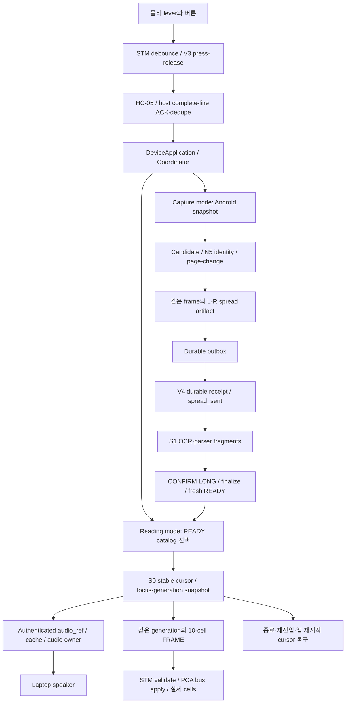

# H1/H2/H3 bounded correction 구현 결과

작성일: 2026-09-08. 근거: [승인된 우선순위](H123_REMEDIATION_PRIORITIES_20260908.md), [독립 진단](H1_H2_H3_SOFTWARE_DIAGNOSTIC_RESULT_20260908.md), [architecture assurance](H123_CRITICAL_PATH_ARCHITECTURE_ASSURANCE_20260908.md).

**승인된 코드 수정과 software 회귀를 완료하고 Laptop integration source에 반영했다. Product 변경은 12개 파일, test 변경·추가는 4개 파일이다. 반영 후 503 tests PASS, 새 source의 G3-A automated PASS. Fresh H1/H2/H3와 H4는 미통과이며 integration ready가 아니다.**

코드 결함 수정, 과거 incident의 원인 확정, 실제 hardware acceptance를 별도 상태로 관리한다. 기존 G3-A PASS와 S-01/S-02 working-tree baseline을 보존했다. 이번 G3-A의 상세 상태는 `manual_pending`이며 실제 청취를 수행한 PASS가 아니다.

## 1. 구현 범위와 source identity

- 기준은 HEAD `ea7e6f24b38bc74bd2405ca1f35ed1acd2bab42e`와 기존 stabilization working tree의 합이다. 구현 전에 416개 source/test 파일을 [baseline archive](evidence/h123-implementation-20260908/baseline-source-tests.zip)에 보존했다.
- 이번 차이는 [파일별 before/after hash](evidence/h123-implementation-20260908/implementation-delta.json)와 [baseline 대비 diff](evidence/h123-implementation-20260908/implementation.diff)로 구분한다. `git diff` 전체에는 이번 작업 이전의 변경도 포함되므로 이번 변경량으로 사용하지 않는다.
- Desktop `D:\Projects\OCR` 및 Laptop `C:\ASL_OCR_INTEGRATION`에 반영했다. Laptop 원본과 신규 파일 목록은 `C:\ASL_OCR_INTEGRATION_RUNTIME\demo-20260905\diagnostics\h123-alignment-1788816158479467400`에 보존했다. [정렬 결과](evidence/h123-implementation-20260908/laptop-alignment-apply.json).
- 적용 직전에 대상 파일의 baseline hash와 실행 중인 Python process 부재를 확인했다. 전체 product 246개 파일의 LF-normalized hash가 Desktop/Laptop에서 일치한다. 실제 Python은 `C:\ASL_OCR_INTEGRATION\.venv-e0b\Scripts\python.exe`이며 Device Runtime/Scanner/Parser import가 모두 integration source를 가리킨다. [최종 검증](evidence/h123-implementation-20260908/final-validation.json).
- 기존 `C:\ASL_OCR`, runtime state/SQLite/artifact/evidence, 기존 환경 manifest를 변경하지 않았다. Laptop D: 접근0, flash0, physical serial/servo packet0. 새 API/camera credential 생성0, credential 출력0, dependency/lockfile 변경0.
- Firmware `main.c`는 양쪽 source에 반영했지만 board binary를 build/flash하지 않았다. 실제 STM은 이번 source와 동일하다고 주장할 수 없다. 기존 Desktop production server를 재시작하거나 교체하지 않았다. G3-A는 별도 loopback 서버를 사용했다.

## 2. 해결한 코드 결함과 최소 수정

| Packet / 기존 분류 | First failing boundary와 수정 | 수정 후 확인한 invariant | Product 파일 수 / 남은 한계 |
|---|---|---|---|
| T1 / confirmed_product_defect, 기존 P1 | IP camera preflight가 webcam 경로를 probe하던 문제. Production과 같은 snapshot factory를 재사용 | `android_ip_camera`는 strict HTTP snapshot만 probe하고 성공/실패 모두 source를 닫음. Webcam fallback0 | 2: `laptop_acceptance.py`, Scanner `runtime_composition.py`. 실물 source 정상 여부는 별도 |
| T2 + CP-T1 / confirmed_product_defect, D01 및 기존 severity 유지 | Handled fatal이 CLI0으로 끝나고 STOPPED 뒤 connectivity cleanup이 생략되던 문제. 최초 fatal 원인과 cleanup 여부를 분리 | Handled fatal CLI2, 첫 fatal reason 보존, fatal 뒤 disconnect 호출, partial startup 정리, 한 close 실패 후 나머지 host resource 정리 | 3: `coordinator.py`, `application.py`, `__main__.py`. 아래 잔여 teardown risk 참조 |
| A1/A2 / confirmed_product_defect, P1 | 다른 thread의 native abort/close와 playback overlap, replacement publish 뒤 old stop이 새 stream을 겨냥하는 경쟁 | Native stream 생성/start/abort/close는 playback owner 하나가 수행. Stop은 cancellation Event만 신호. Old epoch 무효화·cancel을 replacement publication보다 먼저 수행 | 2: audio controller와 audio adapter. 과거 AV 두 건의 exact root는 미확정 |
| B-host + CP-H1 / confirmed_product_defect, P1 | Partial serial read를 완전한 NAV로 ACK, 긴급 RELEASE가 먼저 drain된 뒤 queued ACTIVATED가 hold를 재시작 | LF 완성 전 ACK0, 모든 split에서 원래 sequence만 수락, overflow suffix 폐기. Release watermark 뒤 stale activation은 initial step만 보존하고 repeat 재시작0 | 2: `stm_serial.py`, `hold_repeat.py`. MCU 방향 FRAME loss의 원인 해결을 뜻하지 않음 |
| C2 / confirmed_product_defect, P1 | Snapshot timeout/503 등이 decode fatal과 섞이고 일시 오류가 즉시 capture를 종료 | Transient는 최대 3회 pull로 제한, 0.25/0.5초 retry eligibility를 기록하고 같은 read 안에서 transport retry하지 않음. Permanent는 즉시 terminal. Terminal은 latch. Stop 뒤 늦은 frame publish0 | 2: `sources.py`, `engine.py`. 12초 HTTP read 자체와 input/recognizer 지연은 해결하지 않음 |
| C3 / confirmed_product_defect, P1 | Durable receipt 뒤 page-change UNKNOWN/missing/rejection 동안 안내 producer가 침묵 | 기존 GuidanceArbiter의 stable samples/time/cooldown을 사용해 waiting 안내. SAME/changed/start 시 해당 상태 reset. False PAGE_CHANGED/receipt/READY0 | 1: `engine.py`, C2와 중복. 실제 cue 청취는 별도 |
| D-F parser/overflow branch / 이번 compiled reproduction으로 confirmed_product_defect | Invalid 후반 cell이 앞의 nav/cell state를 먼저 바꾸고, overlong line의 suffix가 별도 FRAME으로 처리됨 | 모든 field validation 후에만 요청 state/PCA 적용. Oversize record는 newline까지 전부 폐기 | Firmware `Core/Src/main.c` 1개. Wire grammar/10-cell encoding/V3/UART IRQ/DMA 변경0 |
| D-F PCA 관측 branch / confirmed software observability defect | Parser accepted와 I2C 성공을 구분하는 결과가 없음 | `last_frame_apply_ok`, `last_applied_generation`, `pca_apply_failures`로 bus 성공·실패를 구분. 실패 motor cache는 갱신하지 않아 같은 frame 재시도로 회복 가능 | 위 `main.c`와 동일. Debugger용 counter이며 host ACK나 물리 위치 검출이 아님 |

Packet 파일 수는 중복을 포함하므로 합산하지 않는다. N=5/K/identity/duplicate threshold, production collection8초, V3 ACK/dedupe/press-release, FRAME field 구성, stable device ID, pin/channel map/LUT/servo angle, auth/TLS 정책은 유지했다. 잘못된 숫자·빈 field·overflow를 받아들이던 parser 동작은 contract에 맞게 거부하도록 수정했다.

## 3. Architecture 결정과 lifecycle

[구현 전 설계 결정](evidence/h123-implementation-20260908/design-decisions.md)을 남긴 뒤 D-A/D-C 조건부 변경을 수행했다. 새 service/process/architecture layer나 public port/dependency 변경은 없다.

| Subsystem | Owner / ordering / queue | Error·cancel·종료 의미 | 이번 assurance 후속 상태 |
|---|---|---|---|
| Live acquisition / page-change | H1 구성은 기존 preview worker가 acquisition을 소유하고 latest frame을 공급. Engine은 analyzer/identity와 state machine을 소유 | Source별 finite retry/permanent terminal 분리. Source generation으로 stop 뒤 결과를 폐기. N5/8초는 불변 | `insufficient_evidence`: 국소 오류는 수정했지만 실제 valid observation 처리량·cancel latency는 미확정 |
| DeviceApplication scheduling | 기존 단일 application loop가 command/S0/Scanner 의미를 직렬 처리. Serial worker가 입력을 먼저 수락·queue | Release priority를 보존하면서 cross-batch stale hold를 막음. S0/recognizer 동기 호출 중 input dispatch latency는 남음 | `architecture_sound_with_local_defect`: 확인한 edge 문제 수정. 지연 계약은 추가 측정 필요 |
| Reading audio | 기존 controller worker가 job/epoch/cache를 소유. PCM callback은 buffer 공급·finish/cancel signal만 수행. Native lifetime은 playback caller 한 곳 | Cancellation은 old target을 먼저 신호. Worker join 실패를 성공 종료로 숨기지 않고, 나중 close 재시도 가능. Underrun/error는 completion이 아닌 failure | 기존 `architecture_change_required`에 대해 2파일 내부 owner 변경을 구현. Native 격리 PASS, incident/H2/H3 종결은 보류 |
| STM host transport | 단일 I/O worker가 handshake/ACK/dedupe/FRAME write 순서를 소유. 기존 bounded ordinary queue, urgent DOWN-release queue와 latest-wins presentation 유지 | Complete-line acceptance, overflow 회복, reconnect마다 framer reset. Accepted input과 presented FRAME은 별개 | `architecture_sound_with_local_defect`: host correction 검증 완료, physical V3 재수용 필요 |
| Firmware RX/parser/PCA | 기존 polling RX와 newline buffer, parser validate→commit, 기존 PCA loop 유지 | RX overlong discard, malformed atomic reject, bus failure 관측. PCA batch delay/IRQ/DMA 변경 없음 | `insufficient_evidence`: parser branch만 닫음. 정상 속도 RX 손상과 actual applied/physical 경계 미확정 |
| CLI fatal | Coordinator terminal reason, Application resource cleanup, module CLI exit status | Fatal STOPPED와 cleanup-done을 분리. Handled fatal 및 Application이 관측한 cleanup failure는 nonzero | `architecture_sound_with_local_defect`: T2 수정. 아래 coordinator 내부 suppressed teardown 예외는 별도 잔여 risk |

Audio callback 전환은 기존 blocking playback port 내부 구현 변경이다. Public queue/port signature, system cue priority, authenticated audio_ref, cache bounds, generation/epoch semantics를 유지했다. Shutdown timeout을 없애거나 interruption을 제거하지 않았다. Windows native driver call 자체의 무기한 hang을 Python 코드만으로 강제 종료할 수 있다고 주장하지 않는다.

## 4. Independent reproduction와 검증 결과

| 검증 | 결과 | Evidence / 주장 범위 |
|---|---|---|
| Laptop staged Device unit | 287 PASS | [staged unit](evidence/h123-implementation-20260908/stage-h123-correction-1788815507296350600.json) |
| Laptop staged Scanner video unit | 206 PASS | 위 evidence. Direct/preview transient, status taxonomy, late frame, waiting guidance 포함 |
| Laptop staged Device integration | 10 PASS | [staged integration](evidence/h123-implementation-20260908/stage-h123-correction-1788815900976129100.json), C0/V4/local composition/STM operation identity와 mode contract |
| Laptop integration에 반영 후 재검증 | **297 Device +206 Scanner =503 PASS** | [final-validation](evidence/h123-implementation-20260908/final-validation.json). 실제 authoritative import/source, 기존 환경 manifest hash 보존 |
| Native speaker backend 격리 | 20 generation supersession PASS, 최신 generation 완료, worker 종료 | [native result](evidence/h123-implementation-20260908/native-interactive-result.json). Realtek/MME, sounddevice0.5.6, Windows interactive session2, 실제 Pythonw3.11.9. Synthetic PCM이며 사람의 청취 확인 없음 |
| Firmware before exact-function compiled fixture | Reject가 state를 바꿈1, overflow suffix dispatch1, HAL 실패20 | [before](evidence/h123-implementation-20260908/firmware-before-03/result.json). MSVC14.43 Windows x64의 32-bit unsigned long / HAL stubs |
| Firmware after compiled fixture | State mutation0, suffix dispatch0, malformed6종 atomic reject, valid accept, bus fail20 관측, 동일 frame bus 회복과 cache 유지 PASS | [after](evidence/h123-implementation-20260908/firmware-after-final/result.json). Exact C bodies hash 포함. STM target build/flash/physical test 아님 |
| 새 source G3-A production-model replay | **automated PASS**, full status `manual_pending` | [report](evidence/h123-implementation-20260908/g3a-evidence/e0b-production-full-model-report.json). 두 receipt/네 fragment/네 accessible pages/네 nonempty braille, duplicate0, Piper audio136개 검증 |
| Live Android read-only probe | **3회 모두 frame 없음**, 약12.25/12.28/12.38초 뒤 finite terminal | [snapshot probe](evidence/h123-implementation-20260908/live-snapshot-probe.json). 현재 source 사용 불가 경계만 확인. LAN/server/app 중 exact root는 insufficient_evidence |

Targeted tests는 [host/tooling/lifecycle](../device-runtime/tests/unit/test_h123_boundaries.py), [audio](../device-runtime/tests/unit/test_h123_audio_lifecycle.py), [camera](../book-scanner/tests/unit/video/test_h123_camera_recovery.py)에 추가했다. 기존 [audio adapter test](../device-runtime/tests/unit/test_reading_audio_adapters.py)는 callback backend에 맞추되 PCM assertion을 유지했다. Acceptance assertion 완화0.

초기 시험의 package별 `tests` import 충돌, staged example/model/firmware 파일 누락, 테스트 fake의 poll drain, Windows temporary directory 권한 및 MSVC helper quoting 실패는 **test_harness_artifact**로 분리했다. Product defect로 승격하지 않았고 기록을 보존했다. Staging 구성과 fixture만 고친 후 실제 package별/authoritative source에서 다시 통과했다. 기존 Desktop dependency warning과 초기 Laptop deprecated escape warning은 이번 dependency 변경 근거로 사용하지 않았다.

## 5. 새 G3-A의 pipeline fidelity

새 isolated Desktop loopback 서버는 실제 PaddleOCR-VL/Piper를 사용했다. 고정 MP4 SHA256은 `16c57970bc493abcef4a1db0f1917b22956bf5ca1a2ee8b4565fde1f6574e6f8`이며, 기존 source replay 자산을 그대로 사용했다.

새 scan session `scan-bbf3d602b6fe491fa33bfc7aca23f770`, datapack `datapack-d8c8a3d4fede4cc9856534e4d98809fa`, fresh READY revision1을 생성했다. Durable `spread_sent` 두 건 뒤 `datapack_saved(revision=1)`이 기록된다. [Console event log](evidence/h123-implementation-20260908/g3a-evidence/e0b-replay-console.log).

Capture controls는 scripted/console이며 audio playback은 `--no-playback`이다. Audio transport의 completion 수치는 fake playback port의 lifecycle evidence다. 실제 스피커 완료가 아니다. 인증된 reading/system audio fetch, cache hit, interruption, unauthorized/cross-session/cross-device rejection은 검증했다. Native speaker 시험과 이 transport 시험의 PASS를 합쳐 combined HTTPS+Piper+physical control acceptance로 계산하지 않는다.

이 replay에는 기존 p030 검증이 포함된다. 최종 demo content pages26/27·28/29의 새 live acceptance를 대체하지 않는다. 이전 G3-A의 audio151개와 이번136개의 차이는 생성 결과의 차이로 기록한다. 이번 acceptance는 고정 resource 개수를 요구하지 않으며, 모든 생성 resource와 네 page 조건을 검증했다. 교재 내용 waiver/P1을 자동 수정하거나 byte-identical OCR 결과라고 주장하지 않았다.

## 6. 새로 확인·정정한 문제와 미해결 원인

| 항목 / 분류 | Concrete trigger·위반 invariant·test gap | 현재 결론과 후속 |
|---|---|---|
| H1 scheduling 설명 정정 / 기존 가설 일부 반증 | Raw H1 config의 `operator_preview_enabled=true`. Production factory가 ThreadedPreviewCameraSource로 wrap. Direct synchronous repro는 preview-OFF 구성 | H1 acquisition 전체가 Application thread를 직접 막았다는 일반화는 철회. Recognizer/analyzer 동기 지연과 collection reset은 계속 조사 대상 |
| Preview worker error lifecycle / confirmed adjacent code failure, 국소 recovery 검증 | 기존 worker가 source exception 후 종료. Retryable gap이 exception이면 capture worker가 사라짐. Direct fake만으로는 이 경계 미검증 | C2의 finite no-frame retry로 transient 때 worker 생존을 검증. Permanent/exhausted 오류는 terminal로 전달. 모든 preview shutdown race가 해결됐다는 뜻은 아님 |
| Camera current availability / environment_failure, exact cause insufficient_evidence | 실제 H1 endpoint/config에서 한 request가 약12초 실패. 세 pull 후 SnapshotTransportError(retryable=true,status=null) | Source transport 이전/내부 경계 실패. 휴대폰 앱/LAN/응답 대기 중 원인은 미확정. 설정·credential·TLS/N/8초 변경 없이 상태 확인 후 다시 측정 |
| Native AV 두 incident / insufficient_evidence | 과거 rapid supersession process access violation. Dump 원본은 유지, native stack/symbol 해석 없음 | A1/A2 race 수정과 native20세대 PASS는 원인 후보를 줄이는 증거. 두 crash의 exact faulting stack 확정 및 combined H2/H3는 미완료 |
| Normal-rate FRAME 손상 / insufficient_evidence | Host normal-rate frame burst 동안 MCU/parser 입력이 손상. 기존 paced/direct serial은 host/Application/S0를 우회 | Compiled parser correction만으로 HC-05/UART RX loss를 닫지 않음. Wire와 MCU RX·ORE/FE/NE·service gap 계측 필요 |
| PCA receive service gap / probable_product_risk, 기존 severity 유지 | 현행 servo batch delay를 stub으로 합산하면 worst modeled frame500ms. 그동안 foreground RX service 지연 가능 | 실제 baud/IRQ/ORE/전원 측정 없이 root 확정이나 DMA/IRQ 구조 전환 금지 |
| Preview stop 및 늦은 preparation / probable_product_risk | Existing preview stop은 worker join2초와 source close를 사용하고 HTTP read는12초까지 대기 가능. Engine preparation은 native/adapter 작업 종료 지연 가능 | 이번 generation fence는 late frame publish를 막지만 worker 종료·resource owner lifetime 전체를 증명하지 않음. D-C cancel timeline과 late completion 계측 필요 |
| Application responsiveness / probable_product_risk | `DeviceApplication.step`에서 S0 command/recognizer 동기 실행 중 새 physical input은 queue에 남음 | Cross-batch hold correction은 repeat 오류를 막지만 dispatch 최대 지연 계약을 보장하지 않음. 실제 queue age/recognizer 시간 측정 후 bounded owner 설계 여부 결정 |
| Coordinator 내부 teardown 오류 관측 / probable_product_risk | `coordinator.stop()` 내부 `scanner.cancel()`/`connectivity.stop()` 예외는 기존처럼 catch-pass. 정상 stop에서 이 예외만 나면 CLI가0일 수 있음 | T2 fatal status와 Application close failure는 수정했지만 모든 teardown 실패의 nonzero를 주장하지 않음. 이 trigger의 dedicated regression 후 동일3파일 예산 안에서 별도 correction 판단. 이번 실제 incident로 승격하지 않음 |
| Host continuous undelimited read / probable_product_risk | Framer는255byte bound지만 실제 `readline()` 호출 자체에는 size 인자가 없음. 지속적으로 newline 없는 stream의 read latency는 fixture가 모델링하지 않음 | Split/overflow correctness PASS와 syscall latency bound는 별개. 실제 pyserial read/timeout 계측 후 필요 시 local cap 검토 |

새 일반 refactoring이나 repository-wide bug hunting으로 확장하지 않았다. 위 미해결 항목은 reachable critical path의 trigger와 기존 test gap이 있는 것만 남겼다. Style 및 비사용 subsystem 정리는 수행하지 않았다.

## 7. Hardware와 harness 경계

- `STM-REQUIRED-CONTROL-INPUT-P1`, `MODE-LEVER-SOLDER-P1`는 **hardware_or_wiring** / 관측에 맞는 추가 측정 대상으로 유지한다. Software ACK나 fake event는 GPIO/button/lever wiring acceptance가 아니다.
- `ACTUATOR-CLEAR-RESIDUAL-P1`는 **hardware_or_wiring**, bus 이후 exact cause는 미확정이다. Zero FRAME accepted·HAL_OK·실제 clear를 분리한다. LUT/각도/채널/핀 변경0.
- 물리 DOWN follow-up의 `NAV,D,S,2`는 V2 asynchronous SHORT다. V3 DOWN A/R acceptance로 재분류하지 않았다.
- 별도의 H3 production run의 V3 handshake/DOWN activated-released evidence는 보존하지만 이번 candidate의 fresh V3 acceptance는 아니다.
- Native test의 scheduled task는 단순 원격 명령과 달리 interactive desktop session2/audio device context를 명시했다. 새 task는 시험 후 제거했다. SSH 콘솔에서 실행된 pytest/G3-A를 동일한 speaker context로 주장하지 않는다.

## 8. 전체 사용자 pipeline과 completion 계약

| 신호 | 증명하는 completion | 증명하지 않는 것 |
|---|---|---|
| `ACK,<sequence>` | Host가 STM 입력 packet을 accepted/deduped | S0 command 완료, FRAME write, servo 적용 |
| Durable outbox | 재시작 가능한 local delivery intent/artifact 보존 | 서버 V4 receipt |
| `spread_sent` | 해당 artifact의 durable V4 receipt | OCR/parser 완료, READY revision |
| `datapack_saved(revision)` | 읽을 수 있는 fresh READY 게시 | 선택/읽기·음성·물리 점자 완료 |
| Reading snapshot | S0가 focus/cursor/generation을 결정 | Audio 완료 및 MCU 적용 |
| Native playback completion | 해당 software/native audio lifecycle 완료 | 사람이 실제 내용을 들었다는 관찰 |
| FRAME host write | 해당 bytes를 serial transport에 전달 | MCU가 동일 bytes를 parse/apply했다는 확인 |
| `last_frame_apply_ok` / applied generation | Firmware에서 요구한 PCA write가 성공한 것으로 관측 | 실제 PWM/servo 위치·점 돌출 상태 |
| Speaker/physical cell observation | 해당 focus/generation과 맞는 실제 출력 | 다른 미검증 경계 및 full H4 자동 PASS |

Production workflow는 capture catalog→새 datapack→두 spread receipt→CONFIRM LONG→fresh READY→reading catalog→page/item/math-window→동일 focus/generation audio+braille→종료/재진입/재시작 cursor 복구다. H1은 physical controls를 console로 대체했고 finalize 전 실패했으며, H2는 existing READY에서 camera/upload/parser/finalize를 생략했다. H3는 physical entrypoint/control이지만 existing READY/catalog에서 시작했다. H3-R의 scripted bootstrap/TTS off/intermediate FRAME suppression은 별도 diagnostic 경로다. 어느 하나도 full H4를 대체하지 않는다.

## 9. 후속 작업 우선순위와 재검증 비용

### 기존 구조 안의 후속 correction packet

1. **T-close 관측 보완 후보:** coordinator 내부 cancel/stop failure의 독립 regression을 먼저 추가한다. 확인 시 기존 T2 3파일 상한 안에서 first failure를 보존하면서 나머지 cleanup을 시도하고 nonzero로 전파한다. 새 supervisor/state migration 불필요. 현재 test PASS를 모든 teardown failure 수용으로 확대하지 않는다.
2. **Host read bound 후보:** 지속 undelimited stream의 실제 pyserial 동작을 계측한 후에만 기존 I/O worker 안의 bounded read를 검토한다. B-host 2파일 상한, V3/ACK/dedupe/FRAME 변경 금지. Fake split 결과만으로 syscall bound correction을 완료 처리하지 않는다.

### 추가 계측·구조 선택이 먼저인 packet

| 우선 | Packet | 다음에 필요한 evidence / 분기 | 변경 예산·migration·rollback·H1–H4 비용 |
|---|---|---|---|
| 1 | D-F RX 및 hardware | 실제 flashed binary identity와 복구 이미지, UART wire/MCU RX/ORE·FE·NE/service gap, I2C/PWM/셀 대응. Parser success와 physical apply를 독립 확인 | 계측3파일, 구조 correction4파일 상한은 기존 계획 유지. IRQ/DMA 전환은 측정 후 별도 설계. Flash 전 source/binary/rollback 확인 필요. Firmware 변경 시 fresh H2/H3와 H4 physical 비용 필수 |
| 1 | D-A native incident closure | Dump stack/symbol 확보 가능성, actual authenticated Piper fetch+rapid control+native speaker combined, cancel/close/re-entry/restart | 이번2파일 owner 변경 범위 유지. 새 process/backend/dependency 필요 시 예산 초과로 별도 설계. DB migration0. Audio 종료 후 두 파일의 delta rollback. H2/H3 및 H4 재검증 |
| 2 | D-C live source/liveness | 현재 Android endpoint 응답 회복 확인, acquisition/analyzer/recognizer timing, valid/missing/reset, input queue age, cancel→worker exit. N5/8초 고정 | 기존 state machine으로 충분하면 source/engine 국소 수정, 부족하면4파일 이하 owner 후보 설계. Threshold 완화 금지. State migration0 지향. Camera delta rollback 후 fresh H1와 H4 |
| 필수 병행 | Physical controls/lever/clear | Label·continuity·GPIO voltage와 V3 packets, PCA bus/PWM/전원과 실제 cell clear 대응 | 측정 전 pin/LUT 변경 금지. 실제 조작마다 목적/packet/stop/evidence 명시. Software PASS로 종결 불가 |

새 architecture layer가 필요하면 파일 목록·상한, 기존 contract 호환성, state migration, rollback, H1–H4 비용을 먼저 검토하고 구현을 시작하지 않는다. 현재 수정은 parser/PCA 수신 servicing 구조를 바꾸지 않았다.

검증 순서는 **targeted→subsystem(완료)→새 source G3-A automated(완료)→fresh H1/H2/H3→H4**다. Fresh H1에는 실제 두 spread26/27·28/29, receipt, CONFIRM LONG/fresh READY가 필요하다. H2에는 normal-rate authenticated TTS+physical braille, H3에는 production entrypoint와 필수 physical V3 controls/reconnect/재진입이 필요하다. 마지막 H4에는 같은 focus/generation 출력과 stable cursor 재시작 복구까지 관찰한다.

## 10. 최종 상태

**Product source modification count: 12 files. Test modification/addition count: 4 files.** 기존 unrelated working-tree 변경은 보존했다. Software corrections는 Desktop/Laptop source에 반영했고 503 tests 및 새 G3-A automated replay가 통과했다. Native 격리와 firmware compiled fixture는 해당 경계의 보조 evidence다. Live camera probe 실패, incident root 부족, fresh physical H1–H3 및 H4 미완료를 남긴다. **H4 BLOCKED / integration ready 아님.**

## 구현 검토 위치

| 경계 | Source |
|---|---|
| Preflight/factory | [laptop_acceptance.py](../device-runtime/src/asl_device/laptop_acceptance.py), [runtime_composition.py](../book-scanner/src/book_scanner/video/runtime_composition.py) |
| Fatal/cleanup/input | [coordinator.py](../device-runtime/src/asl_device/coordinator.py), [application.py](../device-runtime/src/asl_device/application.py), [CLI](../device-runtime/src/asl_device/__main__.py), [hold_repeat.py](../device-runtime/src/asl_device/hold_repeat.py) |
| Audio epoch/native owner | [controller](../device-runtime/src/asl_device/reading_audio.py), [adapter](../device-runtime/src/asl_device/adapters/reading_audio.py) |
| STM worker/line acceptance | [stm_serial.py](../device-runtime/src/asl_device/adapters/stm_serial.py) |
| Camera recovery/guidance | [sources.py](../book-scanner/src/book_scanner/video/sources.py), [engine.py](../book-scanner/src/book_scanner/video/engine.py) |
| Firmware validate/RX/PCA | [main.c](../hardware/stm32/kitel2026final/Core/Src/main.c) |

Evidence 내용 hash와 보고서 link 검사는 [evidence-index.json](evidence/h123-implementation-20260908/evidence-index.json)에 기록한다. Source별 변경 hash는 implementation-delta, 전체 Laptop identity는 final-validation을 기준으로 한다.
