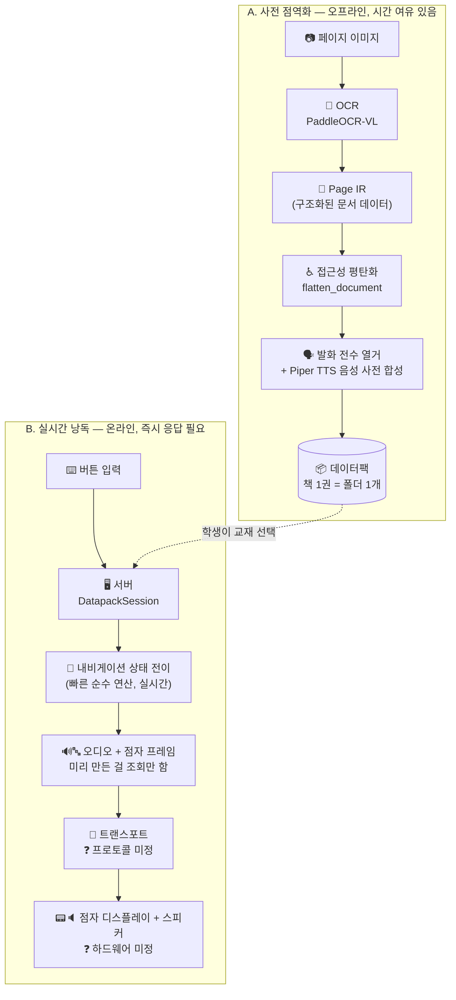

# document-parser

시각장애 학생을 위한 EBS 수학 교재 점역(点譯)·낭독 시스템의 소프트웨어 파이프라인입니다. 종이 교재의 페이지 이미지를 입력받아, 구조를 인식하고, 점자와 음성으로 변환해, 최종적으로 점자 디스플레이/스피커가 달린 전용 하드웨어에서 학생이 버튼으로 탐색하며 문제를 읽을 수 있게 만드는 것이 목표입니다.

이 문서는 프로젝트를 처음 보는 사람이 "전체 그림 → 각 부분이 하는 일 → 코드 어디를 보면 되는지" 순서로 파악할 수 있도록 위에서 아래로(top-down) 설명합니다.

## 왜 이런 구조인가 — 핵심 제약 하나

전체 설계를 이해하는 데 가장 중요한 사실 하나: **OCR과 음성 합성(TTS)은 느린 AI 모델 추론이고, 나머지(페이지 탐색, 점자 렌더링)는 빠른 순수 계산입니다.** 실측 결과 OCR은 페이지당 평균 62초(최대 176초, [docs/gpu-inference-setup.md](docs/gpu-inference-setup.md)), TTS 합성도 발화당 수백 ms가 걸립니다. 반면 "다음 항목으로 이동", "점자 창을 한 칸 스크롤" 같은 동작은 리스트 인덱싱 수준의 연산입니다.

그래서 이 프로젝트는 **"무거운 연산(OCR/TTS)은 학생이 기다리지 않는 시점에 미리 끝내고, 가벼운 연산(탐색/렌더링)만 실시간으로 돌린다"**는 원칙으로 두 단계로 쪼개져 있습니다. 아래 다이어그램의 A/B가 바로 이 두 단계입니다.

## 전체 구조 한눈에 보기



- **A(사전 점역화)**: 학생/보호자가 소장한 교재를 한 번 스캔해서 "데이터팩"이라는 파일 묶음으로 만들어두는 과정입니다. 느려도 괜찮습니다 — 한 권당 한 번만 하면 됩니다.
- **B(실시간 낭독)**: 학생이 실제로 공부할 때 버튼을 눌러가며 교재를 탐색하는 과정입니다. A에서 미리 계산해둔 걸 그대로 꺼내 쓰기 때문에, 여기서는 OCR도 TTS 합성도 다시 하지 않습니다.
- A와 B는 서로 다른 시점에, 서로 다른 응답속도 요구사항으로 실행됩니다 — 이게 이 프로젝트의 가장 중요한 설계 결정입니다.

---

## 파트별 설명

### 1. OCR — 이미지를 구조화된 문서로 (`document_parser.ocr`, `document_parser.serialization`)

**하는 일**: 페이지 이미지 한 장을 받아서, 그 안의 텍스트/수식/표/그림을 각각 구분하고 읽는 순서까지 정해서 반환합니다. 이 결과물을 **Page IR**(Page Intermediate Representation)이라고 부릅니다 — "이 페이지에 뭐가 있고 어떤 순서로 읽어야 하는가"를 JSON으로 표현한 것입니다.

**왜 PaddleOCR-VL인가**: 일반 OCR은 그냥 글자만 인식하지만, 이 프로젝트가 쓰는 `PaddleOCR-VL`은 vision-language 모델이라 텍스트/수식/표/그림을 처음부터 구분해서 내놓습니다. 수학 교재는 "문제 지문 중간에 수식이 섞여 있는" 줄이 매우 흔한데, 일반 OCR은 이걸 어디서 끊어야 할지 알 방법이 없습니다. (참고: 이 저장소에는 `document_parser.layout`/`document_parser.structure`/`reconciliation.py` 등 그 문제를 다른 방식으로 풀려던 **이전 접근**의 코드가 아직 남아있지만, 지금은 기본 경로가 아닙니다. 지금 기본 경로는 아래 코드만 보면 됩니다.)

**핵심 코드**:
- [`ocr/paddleocr_vl_adapter.py`](src/document_parser/ocr/paddleocr_vl_adapter.py) — `PaddleOcrVlAdapter`, 실제 모델 호출부.
- [`serialization/vl_page_ir.py`](src/document_parser/serialization/vl_page_ir.py) — `build_document_ir_from_vl()`, OCR 결과를 Page IR로 변환. 여러 페이지를 한 번에 처리하며 모델은 한 번만 로드합니다.
- [`math/latex_ast.py`](src/document_parser/math/latex_ast.py) — 수식 문자열(LaTeX)을 트리 구조(AST)로 파싱. 이후 점자/음성 변환이 문자열을 다시 파싱하지 않고 이 트리를 그대로 씁니다.

**실행 환경 주의**: GPU에서 돌리려면 반드시 전용 가상환경이 필요합니다(torch를 절대 같이 설치하면 안 됨 — DLL 충돌). 자세한 내용과 실측 속도는 [docs/gpu-inference-setup.md](docs/gpu-inference-setup.md) 참고.

---

### 2. 접근성 변환 — 문서를 점자·음성으로 (`document_parser.accessibility`)

**하는 일**: Page IR(1번의 결과물)을 받아서, 시각장애 학생이 실제로 탐색할 수 있는 형태로 바꿉니다. 여기엔 두 가지 하위 작업이 있습니다.

**(a) 평탄화(flatten)**: Page IR은 문서 구조 트리인데, 이걸 "위/아래 버튼으로 하나씩 넘길 수 있는 순서 있는 목록"으로 펼칩니다. 이 목록의 각 항목을 **focus item**이라 부릅니다.
- [`flattening/structure_nodes.py`](src/document_parser/accessibility/flattening/structure_nodes.py) — `flatten_document()`.

**(b) 번역(translate)**: 각 focus item을 점자 6점 셀과 한국어 발화 문장으로 바꿉니다. 수식은 문자열이 아니라 1번에서 만든 AST를 직접 순회해서 번역합니다(교육부 점자 규정 기반).
- [`braille/`](src/document_parser/accessibility/braille/) — 점자 셀 인코딩, 한글 자모 결합, 수식 기호, 표, 뷰포트(긴 내용을 창 단위로 스크롤) 등.
- [`speech/`](src/document_parser/accessibility/speech/) — 텍스트/수식/표를 한국어 발화 문장으로.

**(c) 내비게이션**: "위/아래/좌/우 버튼을 누르면 상태가 어떻게 바뀌는가"를 결정하는 상태 기계입니다. 이건 AI가 아니라 순수 로직이라 매우 빠릅니다 — 그래서 나중에 실시간 서빙(B 단계) 쪽으로 그대로 재사용됩니다.
- [`domain/navigation_state.py`](src/document_parser/accessibility/domain/navigation_state.py) — 지금 어디를 보고 있는지 나타내는 상태값.
- [`application/document_navigator.py`](src/document_parser/accessibility/application/document_navigator.py), [`application/table_navigator.py`](src/document_parser/accessibility/application/table_navigator.py) — 버튼 입력에 따른 상태 전이 규칙.
- [`application/speech_controller.py`](src/document_parser/accessibility/application/speech_controller.py) — 위 상태 전이를 실제 "무엇을 말하고 점자판에 무엇을 띄울지"와 엮는 조정자.

**직접 만져볼 수 있는 데모**: [`accessibility/cli.py`](src/document_parser/accessibility/cli.py) — 콘솔에서 화살표 커맨드로 점자/TTS 흐름을 확인할 수 있는 실행 가능한 진입점입니다.
```bash
python -m document_parser.accessibility.cli tests/fixtures/accessibility/p019.json --no-audio
```

---

### 3. 데이터팩 — 무거운 연산은 미리 끝내두기 (`document_parser.datapack`)

**하는 일**: 위 1번(OCR)과 2번(번역) 결과, 그리고 그 문서에서 나올 수 있는 **모든 발화**를 실제로 Piper TTS로 음성 합성까지 미리 끝내서, 책 한 권을 통째로 폴더 하나(데이터팩)에 저장합니다. 상세 스키마는 [docs/datapack-schema.md](docs/datapack-schema.md)에 정리되어 있습니다.

**핵심 통찰**: 서빙(B 단계)에서 진짜 느린 건 OCR과 TTS 합성뿐입니다. 내비게이션 상태 전이와 점자 렌더링은 순수 연산이라 실시간으로 돌려도 됩니다. 그래서 데이터팩은 **OCR 결과 + 음성 파일만** 미리 저장하고, 내비게이션 로직 자체는 그대로 서버에서 재사용합니다 — 로직을 두 벌로 관리하지 않기 위해서입니다.

**폴더 구조**:
```
datapacks/
  _system/                 # 책과 무관한 고정 안내 메시지(16종) 오디오 — 모든 책이 공유
  {book_id}/
    manifest.json           # 책 메타데이터
    document.json           # 평탄화된 문서 (2번의 결과물, 그대로)
    audio_index.json        # "이 텍스트를 말하려면 이 wav 파일" 매핑
    audio/*.wav              # 실제 사전 합성된 음성 파일들
```

**핵심 코드**:
- [`datapack/schema.py`](src/document_parser/datapack/schema.py) — 위 구조의 dict 빌더 + 키 생성 규칙.
- [`datapack/ingest.py`](src/document_parser/datapack/ingest.py) — 실제로 이미지→데이터팩을 만드는 CLI. 재실행 시 이미 합성된 오디오는 건너뜁니다(중단돼도 이어서 가능).
  ```bash
  python -m document_parser.datapack.ingest {책ID} {이미지...} \
    --piper-model ... --piper-espeak-data ...
  ```
- [`datapack/loader.py`](src/document_parser/datapack/loader.py) — 만들어진 데이터팩을 다시 읽어 메모리로 로드.

---

### 4. 서버 — 가벼운 상태 기계를 실시간으로 (`document_parser.server`)

**하는 일**: 로드된 데이터팩 위에서, 버튼 입력 하나를 받아 "다음 상태가 뭐고, 지금 점자판엔 뭘 띄우고, 어떤 오디오 파일을 재생해야 하는가"를 즉시 응답합니다. **2번에서 만든 내비게이션 로직(`SpeechController` 등)을 코드 한 줄도 안 바꾸고 그대로 재사용**합니다 — 이게 성립하는 이유가 위 "핵심 통찰"입니다.

**핵심 코드**:
- [`server/session.py`](src/document_parser/server/session.py) — `DatapackSession`. `DatapackTtsEngineAdapter`가 실제 TTS 합성 대신 데이터팩의 오디오를 텍스트로 조회합니다(못 찾으면 조용히 넘어가지 않고 즉시 에러 — ingest와 로직이 어긋났다는 신호이기 때문).
- [`server/store.py`](src/document_parser/server/store.py) — `SessionStore`. 여러 학생/기기의 세션과, 이미 로드한 데이터팩을 메모리에 관리.
- [`server/wire.py`](src/document_parser/server/wire.py) — `handle_wire_command(session, payload)`. **트랜스포트가 뭐든 상관없이 고정된 단 하나의 통합 지점**입니다. 입출력이 전부 JSON 가능한 dict라서, 어떤 프로토콜을 얹어도 이 함수를 얇게 감싸기만 하면 됩니다.

---

### 5. 트랜스포트 & 하드웨어 — 아직 미정 ❓

**하는 일(예정)**: 4번 서버가 만든 응답(점자 프레임 + 오디오)을 실제 점자 디스플레이·스피커가 달린 물리 기기로 전달하고, 반대로 기기의 버튼 입력을 서버로 전달합니다.

**현재 상태**: 프로토콜(HTTP/WebSocket/시리얼 등)이 아직 결정되지 않았습니다 — 하드웨어 팀과의 논의를 거쳐 결정할 예정입니다. 대신, 어떤 프로토콜이 오더라도 다시 건드릴 필요 없도록 [`server/wire.py`](src/document_parser/server/wire.py)의 `handle_wire_command()`라는 고정 경계를 미리 만들어뒀습니다. 실제 프로토콜이 정해지면, "바이트 수신 → JSON dict로 파싱 → `handle_wire_command()` 호출 → 결과 dict를 바이트로 직렬화"라는 아주 얇은 어댑터 하나만 추가하면 됩니다.

또한 이 단계엔 다음도 포함되지만 아직 손대지 않았습니다: 하드웨어가 페이지 이미지를 캡처해 서버로 올리는 흐름(1번 OCR 앞단), 점자 디스플레이 자체의 물리 제어(BLE/UART).

---

## 저장소 구조 요약

```
document-parser/
  src/document_parser/
    ocr/              # 1. OCR 어댑터
    serialization/     # 1. OCR 결과 -> Page IR
    math/               # 1. 수식 LaTeX -> AST 파서
    validation/         # Page IR 스키마 검증
    accessibility/       # 2. 평탄화 + 점자/음성 번역 + 내비게이션
    datapack/            # 3. 데이터팩 스키마 + ingest + loader
    server/               # 4. 실시간 서빙 세션 코어
    layout/ structure/ reconciliation.py / pipeline.py
                         # (레거시) 토큰 단위 OCR을 위한 이전 접근 -- 현재 기본 경로 아님
  docs/                  # 세부 설계 문서 (아래 목록 참고)
  tests/unit/            # 전체 유닛 테스트
  tools/                 # 각 단계를 개별 실행하는 CLI 스크립트 모음
  requirements-gpu.txt   # GPU 추론 전용 가상환경 pin
```

## 시작하기

```bash
# 기본 개발 환경 (OCR/TTS 없이 스키마·로직 테스트만)
cd document-parser
python -m pytest tests/unit -q

# 접근성 데모 (점자/TTS, 음성 없이 콘솔로만)
python -m document_parser.accessibility.cli tests/fixtures/accessibility/p019.json --no-audio

# 실제 GPU OCR + Piper TTS로 데이터팩 만들기 (별도 venv 필요, docs/gpu-inference-setup.md 참고)
python -m document_parser.datapack.ingest my_book page1.png page2.png \
  --piper-model D:/models/piper-korean/ko_KR-kss-medium.onnx \
  --piper-espeak-data D:/espeak-ng-data
```

## 현재 상태

| 파트 | 상태 |
|---|---|
| 1. OCR (PaddleOCR-VL) | ✅ 완료, GPU 실측 검증(17페이지, 평균 62초/페이지) |
| 2. 접근성 변환 (점자·음성 번역, 내비게이션) | ✅ 완료 |
| 3. 데이터팩 (ingest/loader) | ✅ 완료, 실제 GPU+Piper e2e 검증 완료 |
| 4. 서버 (세션 코어, wire 경계) | ✅ 완료 |
| 5. 트랜스포트 프로토콜 | ❓ 미정 — 하드웨어 팀 협의 예정 |
| 5. 하드웨어 (점자 디스플레이 제어, 이미지 캡처/업로드) | ❌ 미착수 |
| 알려진 남은 갭 | 표 셀 안의 수식 점자 렌더링 미구현, 순수 텍스트 안의 비-한글 문자(라틴/숫자) 점자 변환 미흡 |

## 더 읽을거리

- [docs/gpu-inference-setup.md](docs/gpu-inference-setup.md) — GPU 환경 구성 이유와 방법, 실측 타이밍.
- [docs/datapack-schema.md](docs/datapack-schema.md) — 데이터팩 스키마 전체 설계와 근거.
- [docs/implementation-status.md](docs/implementation-status.md), [docs/current-milestone.md](docs/current-milestone.md) — 레거시(토큰 단위 OCR) 파이프라인의 개발 이력.
