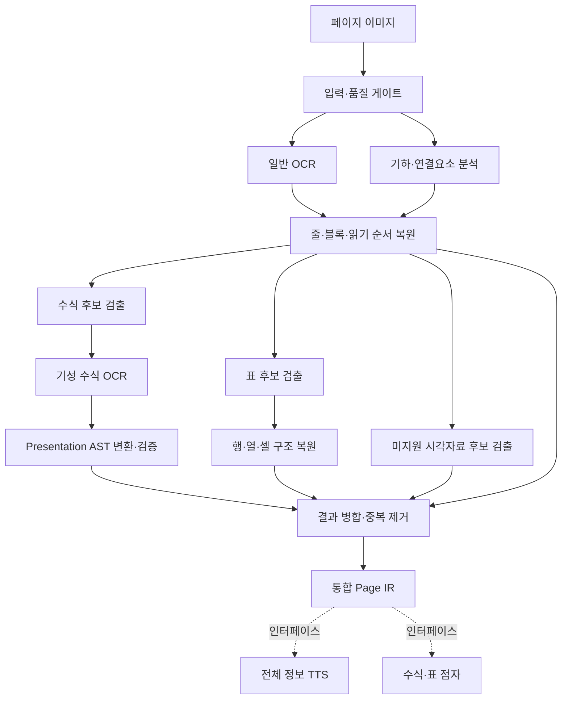

# EBS 수능특강 수학 Document Parser 1차 개발 기획서

- 문서 버전: 1.0
- 작성일: 2026-07-28
- 1차 기준 교재: 2027학년도 EBS 수능특강 수학Ⅰ
- 실행 입력: 페이지 이미지
- 개발 원칙: 기성 OCR 활용, 자체 학습 AI 사용 최소화
- 핵심 산출물: 전체 페이지 구조, 일반 텍스트, 수식 Presentation AST, 표 행·열·셀 구조

---

## 1. 문서 목적

본 문서는 시각장애인의 고등학교 수학 학습을 지원하기 위한 소프트웨어 중 `Document Parser`의 1차 개발 범위와 구현 방식을 정의한다.

Document Parser는 문제집 페이지 이미지를 입력받아 다음 후속 모듈이 사용할 수 있는 구조화 문서를 생성한다.

- 페이지 전체 정보를 재생하는 TTS 모듈
- 수식을 수학 점자로 변환하는 모듈
- 표를 행·열·셀 단위로 탐색하고 점자로 표시하는 모듈

본 기획의 핵심은 다음과 같다.

> Document Parser는 내용의 중요도나 교육적 의미를 판단하지 않는다.  
> 페이지에 존재하는 인식 가능한 콘텐츠를 빠짐없이 보존하고, 수식과 표만 구조적으로 해석한다.

따라서 이 문서에서 사용하는 `분류`는 문제·조건·풀이·정답과 같은 의미 분류가 아니라, 후속 처리를 위한 기술적 콘텐츠 형식 구분을 의미한다.

---

## 2. 프로젝트 배경

대상 시스템은 TTS와 10~20셀 규모의 자체 점자 디스플레이를 병행한다.

점자 디스플레이는 공간이 제한되어 있으므로 모든 본문을 점자로 표시하지 않는다. 1차 서비스에서는 다음 정보만 점자 표시 대상으로 한다.

1. 독립 수식과 문장 내 수식
2. 연립방정식
3. 정의역·범위·부등식 등 수식으로 표현된 조건
4. 표의 현재 행·열·셀에 해당하는 내용

그 외의 인식 가능한 문서 정보는 TTS로 제공한다. TTS 정보의 중요도 선별, 의미 기반 스킵, 자동 요약은 1차 범위에서 다루지 않는다.

---

## 3. 1차 목표

### 3.1 제품 목표

2027학년도 EBS 수능특강 수학Ⅰ의 페이지 이미지를 입력받아 다음을 수행하는 이미지 기반 Document Parser를 개발한다.

1. 페이지 전체의 인식 가능한 텍스트를 추출한다.
2. 각 텍스트의 원본 위치와 읽기 순서를 보존한다.
3. 일반 텍스트와 수식 스팬을 구분한다.
4. 수식을 Presentation AST로 변환한다.
5. 표의 행·열·셀 구조를 복원한다.
6. 일반 OCR, 수식 OCR, 표 인식 결과를 중복 없이 통합한다.
7. 미지원 시각자료와 저신뢰 영역을 누락하지 않고 명시한다.
8. TTS·점자 후속 모듈이 사용할 수 있는 통합 Page IR을 생성한다.

### 3.2 성공 상태

1차 완료 상태는 다음과 같다.

- PDF가 없어도 페이지 이미지만으로 전권을 처리할 수 있다.
- 일반 텍스트, 수식, 표가 원본 좌표와 함께 Page IR에 보존된다.
- 수식은 점자 변환기가 순회할 수 있는 구조를 가진다.
- 표는 행·열·셀 단위로 접근할 수 있다.
- TTS가 읽어야 할 콘텐츠가 중요도 판단 때문에 삭제되지 않는다.
- 파서가 처리하지 못한 영역은 오류 또는 미지원 상태로 남는다.
- 결과에 문제·정답·풀이 의미 분류가 없어도 전체 낭독과 수식·표 점자 출력이 가능하다.

---

## 4. 범위

### 4.1 지원 범위

| 콘텐츠 | 파서 처리 | 후속 활용 |
|---|---|---|
| 일반 한글·숫자·문장부호 | OCR 및 읽기 순서 복원 | TTS |
| 문제 번호·페이지 번호·말머리 | 일반 텍스트로 보존 | TTS |
| 인라인 수식 | 텍스트 줄 내부 수식 스팬 분리 및 AST 변환 | TTS·점자 |
| 독립 수식 | 수식 영역 검출 및 AST 변환 | TTS·점자 |
| 분수·근호·첨자·로그·관계식 | 2차원 구조 보존 | TTS·점자 |
| 연립방정식·여러 줄 수식 | 행과 정렬 관계 보존 | TTS·점자 |
| 표 | 행·열·셀·병합 관계 복원 | TTS·점자 표 탐색 |
| 표 내부 텍스트·수식 | 셀 하위 콘텐츠로 보존 | TTS·점자 |
| 그래프·도형·복잡한 그림 | 보수적으로 미지원 시각자료 후보 표시 | TTS 경고 |

### 4.2 명시적 비범위

다음 기능은 1차 Document Parser에 포함하지 않는다.

- 예제·길잡이·풀이·유제·정답의 의미 역할 분류
- 문제문·조건문·선택지의 의미 구분
- 콘텐츠 중요도 판별
- TTS 정보 선별 또는 요약
- 의미 단위 스킵 기능
- 문제와 정답·풀이 자동 연결
- 정답 비노출 또는 접근 제어
- 문제 자동 풀이
- 수식의 정답 계산
- 자연어 조건의 수학적 의미 해석
- 그래프의 교점·증감·넓이 등 의미 해석
- 기하 도형의 관계 추론
- 자체 글꼴 분류 CNN
- 페이지 영역 분류용 자체 AI 학습
- 비EBS 교재에 대한 완전한 지원 보장

### 4.3 “전체 정보”의 범위

이 기획에서 전체 정보는 다음을 의미한다.

- 페이지에 인쇄되어 있는 OCR 가능한 일반 텍스트
- 수식 OCR로 인식할 수 있는 수학 표현
- 표 셀에 포함된 텍스트와 수식
- 페이지 번호, 장 제목, 꼬리말, 문항 코드 등 인쇄 정보
- 인식하지 못한 영역의 존재와 위치

다음 정보까지 자동 설명한다는 의미는 아니다.

- 장식 색상과 테두리의 미적 의미
- 사진 내용
- 그래프의 형상과 함수 관계
- 도형의 공간 관계
- OCR로 관찰되지 않은 숨은 의미

---

## 5. 핵심 설계 원칙

### 5.1 이미지 단독 입력 우선

실행 파이프라인은 PDF 텍스트 계층이나 글꼴 메타데이터에 의존하지 않는다.

PDF는 다음 용도로만 사용할 수 있다.

- 교재 구조를 빠르게 이해하는 개발 참고자료
- 골든 정답 작성 시 확대 확인
- 페이지 이미지 생성
- OCR 결과의 수동 비교

모든 필수 합격 시험은 이미지 단독 입력으로 수행한다.

### 5.2 의미 중립성

파서는 `풀이`, `정답`, `조건`, `핵심`을 판단하지 않는다. 해당 문자열이 인쇄되어 있으면 일반 텍스트로 보존한다.

필수 콘텐츠 종류는 다음 네 가지로 제한한다.

```text
TEXT
MATH
TABLE
UNSUPPORTED_VISUAL
```

필요한 경우 `UNKNOWN`을 추가하되, `UNKNOWN`은 삭제 대상이 아니라 검토 대상이다.

### 5.3 원본 보존

정규화된 텍스트와 함께 다음 원본 정보를 보존한다.

- 원시 OCR 문자열
- 원본 좌표
- 원본 이미지 크롭 참조
- 사용한 OCR 엔진과 버전
- 신뢰도
- 대안 인식 결과
- 후처리 및 수정 이력

### 5.4 실패 가시성

파싱 실패를 빈 문자열이나 누락으로 처리하지 않는다.

```text
인식 성공 → 구조화 노드
인식 불확실 → 저신뢰 노드 + 이슈
인식 실패 → 원본 좌표 + 실패 상태
지원 불가 → UNSUPPORTED_VISUAL
```

### 5.5 규칙 우선, 학습 모델 최소화

팀이 직접 학습하거나 미세조정하는 모델은 1차에서 사용하지 않는다. 기성 OCR을 고정된 인식 모듈로 사용하고, 모듈 선택·결과 결합·검증은 규칙으로 구현한다.

### 5.6 파서와 출력기 분리

Document Parser는 음성을 합성하거나 점형을 생성하지 않는다.

```text
Document Parser
→ Page IR
   ├─ TTS Serializer
   ├─ Math Braille Translator
   └─ Table Navigator
```

---

## 6. 용어 정의

| 용어 | 정의 |
|---|---|
| OCR Token | OCR이 인식한 문자 또는 단어와 좌표 |
| Line | 동일 기준선 또는 읽기 흐름에 속하는 토큰 묶음 |
| Block | 하나 이상의 줄로 구성된 공간적 문단 |
| Span | 줄 내부의 연속된 TEXT 또는 MATH 구간 |
| Region | TEXT·MATH·TABLE·UNSUPPORTED_VISUAL 중 하나로 표현되는 페이지 영역 |
| Page IR | 한 페이지의 콘텐츠와 구조를 표현하는 중간 표현 |
| Presentation AST | 수식이 화면에 배치된 구조를 표현하는 트리 |
| Table IR | 표의 행·열·셀·병합 관계를 보존하는 구조 |
| Reading Order | TTS가 페이지를 순서대로 소비할 수 있는 노드 순서 |
| Golden Page | 사람이 정답 구조를 작성해 회귀시험 기준으로 사용하는 페이지 |

---

## 7. 시스템 경계와 전체 구조



### 7.1 Document Parser 내부 모듈

| 모듈 | 책임 |
|---|---|
| `ImageIngestor` | 이미지 로딩, 페이지 식별 |
| `ImageQualityGate` | 해상도·회전·흐림·잘림 검사 |
| `ImagePreprocessor` | 기울기·원근·명암 보정 |
| `GeneralOcrAdapter` | 일반 텍스트 및 좌표 추출 |
| `LayoutBuilder` | 토큰·줄·블록·컨테이너 구성 |
| `ReadingOrderResolver` | 페이지 읽기 순서 결정 |
| `MathCandidateDetector` | 수식 가능 영역과 혼합 줄 수식 스팬 검출 |
| `FormulaOcrAdapter` | 수식 이미지를 LaTeX·MathML 등으로 인식 |
| `MathAstBuilder` | 원시 수식을 Presentation AST로 변환 |
| `MathAstValidator` | 괄호·첨자·분수·토큰 소비 검사 |
| `TableCandidateDetector` | 표 후보 검출 |
| `TableStructureParser` | 행·열·셀·병합 셀 복원 |
| `UnsupportedVisualDetector` | 그래프·도형·복잡한 그림 후보 표시 |
| `ResultReconciler` | 중복 제거, 결과 선택, 좌표 정렬 |
| `PageIrSerializer` | 스키마 검증과 결과 저장 |
| `IssueReporter` | 저신뢰·실패·충돌 기록 |

### 7.2 Document Parser 외부 모듈

다음 모듈은 별도 프로젝트 또는 후속 단계로 취급한다.

- 일반 텍스트 TTS
- 수식 AST 기반 TTS
- 한국 수학 점자 변환기
- 10~20셀 점자 뷰포트
- 표 행·열 탐색 인터페이스
- 음성·점자 동기화
- 문제·정답 접근 정책
- 의미 기반 UX

---

## 8. 입력 명세

### 8.1 입력 구조

```json
{
  "book_id": "ebs-2027-math1",
  "pages": [
    {
      "page_id": "image-0008",
      "image_path": "pages/0008.png",
      "sequence_index": 8
    }
  ],
  "profile_hint": "EBS_SUNEUNG_TEUKGANG",
  "parser_options": {
    "preserve_color": true,
    "emit_debug_artifacts": false
  }
}
```

`profile_hint`는 선택 항목이다. 값이 없어도 기본 파이프라인은 실행되어야 한다.

### 8.2 권장 이미지 조건

| 항목 | 권장 조건 |
|---|---|
| 페이지 구성 | 이미지 하나에 페이지 하나 |
| 기본 해상도 | 300dpi 상당 |
| 긴 변 | 약 2,800~3,200px 이상 |
| 조밀한 수식 | 400dpi 상당 권장 |
| 조건부 하한 | 250dpi 상당 |
| 색상 | RGB 또는 8비트 회색조 |
| 회전 | 가능하면 ±2도 이내 |
| 잘림 | 본문과 페이지 번호가 모두 포함되어야 함 |
| 압축 | 과도한 JPEG 블록 노이즈 지양 |
| 배경 | 페이지와 배경 경계가 분명해야 함 |

위 수치는 절대 합격 기준이 아니라 초기 권장값이다. 실제 하한은 기성 OCR 기준선 시험을 통해 확정한다.

### 8.3 품질 게이트

품질 게이트는 다음 상태 중 하나를 반환한다.

```text
PASS
PASS_WITH_CORRECTION
LOW_QUALITY
REJECTED
```

검사 항목:

- 유효 픽셀 크기
- 페이지 경계 검출
- 본문 잘림
- 기울기
- 원근 왜곡
- 초점 흐림
- 과다 노출·과소 노출
- 압축 노이즈
- 중복 페이지

`LOW_QUALITY` 페이지도 가능한 범위에서 처리하되 결과에 품질 이슈를 남긴다.

---

## 9. 출력 명세: Page IR

### 9.1 상위 구조

```text
ParsedDocument
├─ document_manifest
├─ pages[]
│  ├─ page_geometry
│  ├─ nodes[]
│  ├─ reading_order[]
│  ├─ parse_issues[]
│  └─ quality_report
├─ engine_manifest
└─ validation_summary
```

### 9.2 공통 노드

```json
{
  "node_id": "p008-n017",
  "content_type": "TEXT",
  "bbox": {
    "x": 231,
    "y": 405,
    "width": 812,
    "height": 53
  },
  "normalized_bbox": {
    "x": 0.164,
    "y": 0.241,
    "width": 0.576,
    "height": 0.032
  },
  "reading_order_index": 17,
  "confidence": 0.96,
  "source_engine": "general-ocr-adapter",
  "source_crop_ref": "crops/p008-n017.png",
  "issues": []
}
```

### 9.3 TEXT 노드

```json
{
  "content_type": "TEXT",
  "raw_text": "함수 f(x)에 대하여",
  "normalized_text": "함수 f(x)에 대하여",
  "spans": [
    {
      "span_type": "TEXT",
      "text": "함수 "
    },
    {
      "span_type": "MATH_REF",
      "math_node_id": "p008-m003"
    },
    {
      "span_type": "TEXT",
      "text": "에 대하여"
    }
  ]
}
```

혼합 줄의 수식은 TEXT 노드 안에 문자열로 중복 저장하지 않고 `MATH_REF`로 참조한다.

### 9.4 MATH 노드

```json
{
  "content_type": "MATH",
  "raw_formula": "f(x)=(x+3)^{-\\frac{2}{3}}",
  "formula_format": "LATEX",
  "presentation_ast": {
    "type": "Relation",
    "operator": "=",
    "left": {
      "type": "FunctionApplication",
      "name": "f",
      "argument": {
        "type": "Identifier",
        "value": "x"
      }
    },
    "right": {
      "type": "Power",
      "base": {
        "type": "Parenthesized",
        "body": {
          "type": "Row"
        }
      },
      "exponent": {
        "type": "UnaryMinus",
        "operand": {
          "type": "Fraction"
        }
      }
    }
  },
  "unconsumed_tokens": [],
  "alternative_candidates": []
}
```

### 9.5 TABLE 노드

```json
{
  "content_type": "TABLE",
  "row_count": 4,
  "column_count": 3,
  "cells": [
    {
      "cell_id": "p102-t01-r01-c02",
      "row_index": 1,
      "column_index": 2,
      "row_span": 1,
      "column_span": 1,
      "bbox": {
        "x": 430,
        "y": 510,
        "width": 210,
        "height": 78
      },
      "content_nodes": [
        {
          "content_type": "TEXT",
          "normalized_text": "도수"
        }
      ]
    }
  ],
  "structure_confidence": 0.93
}
```

표의 첫 행이나 첫 열을 의미적으로 헤더라고 확정하지 않는다. 기하학적으로 헤더 가능성을 표시해야 한다면 `header_candidate`를 선택 정보로 둘 수 있다.

### 9.6 미지원 시각자료 노드

```json
{
  "content_type": "UNSUPPORTED_VISUAL",
  "visual_type_candidate": "GRAPH_OR_DIAGRAM",
  "embedded_text_nodes": ["p090-n013", "p090-n014"],
  "handling": "ANNOUNCE_AND_PRESERVE_TEXT",
  "confidence": 0.74
}
```

시각자료 안에서 OCR된 축 이름·숫자·범례는 삭제하지 않고 하위 텍스트로 보존한다. 다만 이 정보만으로 그래프의 의미가 전달된다고 표시해서는 안 된다.

### 9.7 금지 필드

1차 필수 스키마에는 다음 필드를 두지 않는다.

```text
importance
educational_role
problem_role
answer_of
solution_of
visibility_level
is_core_content
tts_priority
```

후속 연구에서 추가하더라도 Document Parser 원본 출력과 분리된 확장 계층으로 구현한다.

---

## 10. 처리 파이프라인

### 10.1 이미지 입력과 전처리

처리 순서:

1. 이미지 무결성 확인
2. 페이지 경계 검출
3. 방향 판정
4. 기울기 보정
5. 필요 시 원근 보정
6. 색상 원본 보존
7. OCR용 회색조·이진화 파생 이미지 생성
8. 여러 전처리 결과 중 OCR 기준선이 가장 좋은 조합 선택

원본 이미지를 덮어쓰지 않는다. 전처리 이미지는 파생물로 관리한다.

### 10.2 일반 OCR

기성 한국어 OCR에서 요구하는 결과:

- 문자 또는 단어 문자열
- 단어·줄 좌표
- 다각형 또는 회전 박스
- 인식 신뢰도
- 줄 그룹 후보
- 문자 방향
- 엔진·모델 버전

일반 OCR은 페이지 전체에 실행한다. 수식 영역을 미리 완전히 제거하지 않는다. 일반 OCR 결과도 수식 후보 검출과 페이지 읽기 순서 복원에 유용하기 때문이다.

### 10.3 레이아웃 복원

레이아웃 계층:

```text
Glyph or Token
→ Line
→ Block
→ Container
→ Page
```

사용 증거:

- 토큰의 수평·수직 거리
- 기준선 유사성
- 글자 높이
- 좌우 정렬
- 줄 간격
- 박스와 테두리
- 페이지 여백
- 열 경계
- EBS 페이지 프로필

폰트 이름이나 CNN 글꼴 분류는 사용하지 않는다.

### 10.4 읽기 순서

기본 읽기 순서는 다음 규칙으로 결정한다.

1. 페이지 컨테이너를 먼저 구분한다.
2. 컨테이너 내부에서 열 구조를 판정한다.
3. 같은 열에서는 위에서 아래로 읽는다.
4. 같은 줄에서는 좌에서 우로 읽는다.
5. 인라인 수식은 원래 문장 위치에 삽입한다.
6. 독립 수식은 인접 설명 문단 사이의 한 노드로 배치한다.
7. 표는 셀 문자열로 분해해 본문에 흩뜨리지 않고 하나의 TABLE 노드로 둔다.
8. 머리말·꼬리말·페이지 번호도 읽기 순서에 포함한다.

결과는 단순 배열과 선후관계 그래프를 함께 보존할 수 있다. 그래프에는 순환이 없어야 한다.

---

## 11. 수식 검출

### 11.1 목표

일반 텍스트 영역 안에 존재하는 인라인 수식과 독립 수식을 높은 재현율로 검출한다.

수식 누락은 다음 문제를 일으킨다.

- 일반 OCR이 수식을 잘못 읽음
- TTS에서 수식 구조가 사라짐
- 점자 변환 대상에서 누락됨

따라서 1차에서는 정밀도보다 재현율을 우선한다. 수식 후보가 과다 검출되더라도 수식 OCR과 AST 검증 단계에서 되돌릴 수 있도록 한다.

### 11.2 규칙 증거

#### 문자 구성

- 숫자·라틴 변수·그리스 문자
- 관계 기호 `=`, `<`, `>`, `≤`, `≥`
- 연산 기호 `+`, `−`, `×`, `÷`
- 근호·절댓값·괄호
- `log`, `sin`, `cos`, `tan`, `lim`
- 함수 형태 `f(x)`

#### 2차원 배치

- 기준선 위의 작은 첨자
- 기준선 아래의 작은 첨자
- 긴 수평선과 위·아래 구성 요소
- 근호 덮개선
- 큰 중괄호와 여러 줄 정렬
- 여러 줄에서 반복되는 등호 위치
- 상하 한계를 가진 기호

#### 일반 OCR 상태

- 수학 기호가 포함된 저신뢰 토큰
- 숫자·기호가 많은 토큰열
- 일반 OCR이 여러 조각으로 분리한 영역
- 문자 연결요소는 존재하지만 정상적인 한글 단어로 복원되지 않는 영역

#### 공간 문맥

- 문장 중간의 짧은 비한글 영역
- 독립적으로 중앙 정렬된 기호열
- 선택지와 유사한 반복 배치
- 표 셀 내부의 수학 기호열

### 11.3 사용하지 않는 단독 규칙

다음 신호는 단독 확정 규칙으로 사용하지 않는다.

- 필기체처럼 보인다.
- 글자가 기울어져 있다.
- 본문과 다른 글꼴이다.
- 글자가 크거나 작다.
- 페이지 중앙에 있다.

이 신호는 OCR 결과에서 별도 비용 없이 얻을 수 있을 때 보조 점수로만 사용할 수 있다.

### 11.4 혼합 줄 분할

예:

```text
"함수 " | "f(x)=(x+3)^(-2/3)" | "에 대하여 "
 TEXT   |         MATH          |    TEXT
```

처리:

1. 줄 전체의 OCR 토큰과 좌표를 수집한다.
2. 수식 시작·종료 후보를 계산한다.
3. 수식 후보에 좌우 여백을 추가해 크롭한다.
4. 수식 OCR을 실행한다.
5. AST 파싱과 토큰 소비 검사를 수행한다.
6. 확정된 수식을 `MATH_REF`로 원래 줄에 삽입한다.
7. 중복되는 일반 OCR 토큰은 발화 대상에서 제외하되 원시 결과로 보존한다.

### 11.5 연립방정식과 여러 줄 수식

다음 기하학적 증거를 결합한다.

- 왼쪽의 큰 중괄호
- 둘 이상의 수식 행
- 관계 기호의 수직 정렬
- 행 간격의 반복
- 일반 표처럼 전체 격자를 형성하지 않음

연립방정식은 TABLE이 아니라 `SystemOfEquations` 또는 `Cases` 수식 노드로 표현한다.

---

## 12. 수식 OCR과 Presentation AST

### 12.1 수식 OCR 어댑터

수식 OCR 엔진은 교체 가능하게 구현한다.

```text
FormulaCrop
→ FormulaOcrAdapter
→ FormulaRecognitionCandidate[]
```

후보 결과:

- 원시 LaTeX 또는 MathML
- 엔진 신뢰도
- 대안 후보
- 입력 크롭 좌표
- 엔진·모델 버전

### 12.2 Presentation AST 범위

1차 수학Ⅰ에서 우선 지원할 노드:

- `Row`
- `Number`
- `Identifier`
- `Constant`
- `Operator`
- `Relation`
- `UnaryMinus`
- `Fraction`
- `Power`
- `Subscript`
- `Root`
- `Parenthesized`
- `AbsoluteValue`
- `FunctionApplication`
- `Logarithm`
- `UnderOver`
- `Equation`
- `SystemOfEquations`
- `Cases`

향후 과목 확장을 위해 다음 노드는 예약할 수 있다.

- `Limit`
- `Summation`
- `Integral`
- `Derivative`
- `Matrix`
- `SetExpression`
- `ProbabilityExpression`

### 12.3 AST의 책임

Presentation AST는 다음을 보존한다.

- 분자와 분모
- 밑과 지수
- 근호 내부
- 괄호 범위
- 아래첨자
- 함수 이름과 인자
- 수식의 좌변과 우변
- 여러 수식 행의 순서
- 연립식의 포함 관계

다음은 필수 책임이 아니다.

- 수식 계산
- 수학적으로 동치인 식 판정
- 문제 풀이
- 자연어 조건과 수식의 논리 결합
- 정답 추론

### 12.4 제한 문법

수식 OCR이 생성한 임의 LaTeX 전체를 지원하려 하지 않는다. 실제 수학Ⅰ 골든 데이터에 등장하는 문법부터 지원한다.

파싱하지 못한 명령은 삭제하지 않고 다음과 같이 남긴다.

```json
{
  "type": "UnknownCommand",
  "raw": "\\unknown",
  "issue": "UNSUPPORTED_MATH_COMMAND"
}
```

### 12.5 AST 검증

검증 항목:

- 모든 원시 토큰의 소비 여부
- 괄호 쌍
- 분수의 분자·분모 존재
- 지수·아래첨자의 대상 존재
- 관계식 좌우 피연산자
- 연립식의 행 수
- 수식 크롭 좌표와 AST 출처 연결
- AST 재직렬화 가능 여부
- 대안 OCR 후보와의 구조 일치 여부

AST 검증이 실패하면 수식을 일반 텍스트로 조용히 강등하지 않는다. `MATH` 노드와 원본 수식 이미지를 보존하고 `AST_INVALID` 이슈를 추가한다.

---

## 13. 표 검출과 Table IR

### 13.1 목표

표를 단순한 줄 문자열로 평탄화하지 않고 행·열·셀 관계를 보존한다.

### 13.2 선이 있는 표

규칙:

- 수평선·수직선 검출
- 교차점 계산
- 닫힌 셀 후보 생성
- 셀 내부 OCR 토큰 할당
- 병합 셀 추정
- 행·열 인덱스 생성

OpenCV 기반 선 검출과 좌표 규칙을 우선 사용한다.

### 13.3 선이 없는 표

규칙:

- 반복되는 텍스트 중심점
- 일정한 열 간격
- 유사한 행 높이
- 열별 좌우 정렬
- 여러 행에서 반복되는 공백 경계
- 표 주변의 여백 또는 외곽 컨테이너

선이 없는 표는 문단 정렬과 혼동될 수 있으므로 `structure_confidence`를 반드시 제공한다.

기하학적 규칙의 성능이 부족할 때에만 기성 표 구조 인식기를 보조 모듈로 비교한다. 1차에서 자체 표 인식 모델을 학습하지 않는다.

### 13.4 셀 콘텐츠

각 셀은 다음 하위 노드를 가질 수 있다.

- 일반 텍스트
- 숫자
- 수식
- 빈 셀
- 저신뢰 콘텐츠

수식 후보가 있는 셀에는 수식 OCR과 AST 변환을 적용한다.

### 13.5 병합 셀

모든 셀은 다음 값을 가진다.

```text
row_index
column_index
row_span
column_span
```

병합 여부를 확정할 수 없으면 구조를 임의 확정하지 않고 `AMBIGUOUS_CELL_SPAN`을 남긴다.

### 13.6 헤더

1차 파서는 셀의 교육적 역할을 해석하지 않는다.

다만 다음 기하학적 후보는 선택적으로 제공할 수 있다.

- 첫 행
- 첫 열
- 나머지 셀과 다른 정렬·배경을 가진 행·열

이 값은 `header_candidate`이며 확정된 의미 태그가 아니다.

---

## 14. 미지원 시각자료 처리

그래프와 도형의 의미 해석은 제외하지만 해당 영역을 무시해서는 안 된다.

### 14.1 보수적 후보 검출

- OCR 텍스트가 거의 없는 큰 연결 영역
- 축과 유사한 수직·수평선
- 반복 눈금
- 화살표
- 곡선·다각형
- 본문과 분리된 큰 그림 영역
- 텍스트·수식·표로 설명되지 않는 잔여 영역

1차에서는 그래프와 기하 도형을 정확히 세분하지 않아도 된다. `GRAPH_OR_DIAGRAM` 후보로 묶을 수 있다.

### 14.2 처리 원칙

- 영역 좌표 보존
- 내부 OCR 텍스트 보존
- Page IR에 미지원 상태 기록
- TTS 모듈이 경고할 수 있는 상태 제공
- 미지원 영역을 일반 수식으로 잘못 확정하지 않음

---

## 15. 결과 통합과 중복 제거

일반 OCR, 수식 OCR, 표 인식은 같은 픽셀을 중복 처리할 수 있다. 따라서 `ResultReconciler`가 최종 발화·표시 대상 노드를 결정한다.

### 15.1 중복 유형

- 일반 OCR이 수식을 문자 조각으로 출력
- 수식 OCR과 일반 OCR이 같은 수식을 각각 출력
- 표 전체 OCR과 셀 OCR이 같은 문자열 출력
- 시각자료 내부 텍스트가 페이지 본문에도 중복 배치
- 전처리 버전별 OCR 결과 중복

### 15.2 결합 규칙

1. 좌표 중첩률을 계산한다.
2. 노드 유형의 우선순위를 적용한다.
3. 구조 검증 결과를 확인한다.
4. 선택되지 않은 후보도 원시 결과에는 남긴다.
5. 최종 `reading_order`에는 소비할 대표 노드만 넣는다.

기본 우선순위:

```text
검증된 TABLE 셀 구조
> 검증된 MATH AST
> 고신뢰 TEXT
> 저신뢰 후보
```

우선순위는 삭제 순서가 아니다. 최종 소비 노드 선택 규칙이다.

### 15.3 무음 누락 방지

다음 조건을 검사한다.

- OCR 토큰이 어떤 최종 노드에도 속하지 않음
- 원본의 큰 연결 영역이 어떤 Region에도 속하지 않음
- 수식 후보가 일반 텍스트와 수식 양쪽에서 모두 제거됨
- 표 셀 콘텐츠가 표 노드와 페이지 읽기 순서 양쪽에서 누락됨

소유되지 않은 토큰이나 영역은 `ORPHAN_CONTENT` 이슈로 기록한다.

---

## 16. EBS 포맷 규칙의 역할

EBS 규칙은 교육적 의미 분류가 아니라 레이아웃 보정에만 사용한다.

### 16.1 허용되는 EBS 규칙

- 페이지 여백
- 상단·하단 고정 영역
- 한 페이지의 대표 열 수
- 반복되는 박스 형태
- 문제 영역의 일반적인 정렬
- 선택지의 반복적 가로 배치
- 표와 본문 사이의 여백
- 페이지 번호의 대표 위치
- 동일 계열 페이지에서 반복되는 컨테이너 구조

### 16.2 사용하지 않는 EBS 규칙

- `예제`이면 중요 콘텐츠
- `풀이`이면 숨김 콘텐츠
- `유제`이면 특정 문제와 연결
- `정답과 풀이`이면 자동 잠금
- 색상이 녹색이면 특정 교육 역할

앵커 문구는 일반 OCR 품질 확인이나 공간 컨테이너 탐색의 보조 신호로는 사용할 수 있지만, 1차 필수 결과에 교육 역할을 생성하지 않는다.

### 16.3 프로필 구조

```yaml
profile_id: ebs_suneung_teukgang_2027
page_geometry:
  expected_aspect_ratio_range: [0.68, 0.76]
  common_margin_ranges: {}
layout_hints:
  common_column_counts: [1, 2]
  footer_band: {}
  header_band: {}
detector_hints:
  choice_alignment_patterns: []
  common_container_shapes: []
```

프로필이 없어도 범용 좌표 규칙으로 실행할 수 있어야 한다.

---

## 17. AI 및 기성 OCR 사용 정책

### 17.1 허용 범위

- 사전 학습된 한국어 OCR
- 사전 학습된 수식 OCR
- 필요 시 사전 학습된 표 구조 인식기
- OCR이 기본 제공하는 좌표·신뢰도·줄 정보

### 17.2 금지 또는 보류

- 팀 데이터로 OCR 재학습
- 자체 글꼴 CNN
- 자체 페이지 영역 분류 모델
- 자체 수식·표 검출 모델
- 의미 역할 분류 LLM·VLM
- OCR 결과를 외부 생성형 모델이 임의 수정하는 방식

### 17.3 어댑터 원칙

특정 OCR 공급자에 종속되지 않도록 공통 인터페이스를 둔다.

```text
GeneralOcrAdapter
FormulaOcrAdapter
OptionalTableRecognizerAdapter
```

각 어댑터는 공통 좌표계와 공통 신뢰도 구조로 변환한다.

### 17.4 자체 AI 개발 재검토 조건

다음이 실제 시험으로 확인된 이후에만 자체 AI를 검토한다.

1. 규칙 변경으로 해결되지 않는 반복 실패가 충분히 존재한다.
2. 실패 유형을 대표하는 라벨 데이터가 확보되었다.
3. 기성 모델 교체로 해결되지 않는다.
4. 학습·검증·배포 비용보다 기대 개선이 크다.
5. 규칙 기반 기준선과 비교할 평가셋이 존재한다.

---

## 18. 후속 모듈 인터페이스

이 절은 출력 정책을 구현하기 위한 것이 아니라 Parser 출력의 충분성을 검증하기 위한 계약이다.

### 18.1 TTS 소비 규칙

TTS는 `reading_order`의 모든 소비 가능 노드를 받는다.

| 노드 | TTS 소비 |
|---|---|
| TEXT | 전체 문자열 |
| MATH | AST 기반 수식 발화 |
| TABLE | 표 구조에 따른 전체 셀 발화 |
| UNSUPPORTED_VISUAL | 미지원 안내와 내부 OCR 텍스트 |
| UNKNOWN | 인식 불확실 안내와 가능한 원문 |

파서는 `tts_priority`나 `skip`을 결정하지 않는다.

### 18.2 점자 소비 규칙

| 노드 | 점자 소비 |
|---|---|
| TEXT | 일반적으로 소비하지 않음 |
| MATH | Presentation AST를 수학 점자로 변환 |
| TABLE | 현재 선택 셀의 텍스트·숫자·수식 소비 |
| UNSUPPORTED_VISUAL | 소비하지 않음 |
| UNKNOWN | 자동 변환하지 않고 오류 처리 |

표 안의 일반 텍스트는 표 탐색을 위해 점자 표시 대상이 될 수 있다. 이는 일반 본문을 점자로 제공한다는 뜻이 아니라 표 셀이라는 구조적 문맥을 보존하기 위한 예외다.

### 18.3 현재 페이지 원칙

Parser는 사용자가 요청한 페이지의 모든 콘텐츠를 반환한다.

- 다른 페이지의 답이나 풀이를 자동 조회하지 않는다.
- 현재 페이지가 정답 페이지인지 판단하지 않는다.
- 현재 페이지에 답이나 풀이가 인쇄되어 있으면 일반 콘텐츠로 반환한다.

정답 비노출이 필요해질 경우 페이지 접근 제어 또는 별도 의미 계층에서 구현한다.

---

## 19. 기능 요구사항

### 19.1 P0 필수 요구사항

| ID | 요구사항 |
|---|---|
| `DP-ING-001` | PNG·JPEG 페이지 이미지를 입력받아야 한다. |
| `DP-ING-002` | PDF 없이 동일한 필수 결과를 생성해야 한다. |
| `DP-QLT-001` | 해상도·흐림·기울기·잘림 상태를 보고해야 한다. |
| `DP-OCR-001` | 일반 텍스트와 좌표·신뢰도를 추출해야 한다. |
| `DP-LYT-001` | 토큰을 줄·블록으로 구성해야 한다. |
| `DP-ORD-001` | 페이지 전체 읽기 순서를 생성해야 한다. |
| `DP-MTH-001` | 인라인·독립 수식 후보를 검출해야 한다. |
| `DP-MTH-002` | 수식 OCR 결과를 Presentation AST로 변환해야 한다. |
| `DP-MTH-003` | 파싱 실패 수식을 누락하지 않아야 한다. |
| `DP-TBL-001` | 선이 있는 표의 행·열·셀을 복원해야 한다. |
| `DP-TBL-002` | 표 셀 내부의 텍스트와 수식을 보존해야 한다. |
| `DP-MRG-001` | 일반 OCR·수식 OCR·표 OCR 중복을 제거해야 한다. |
| `DP-VIS-001` | 미지원 시각자료 후보와 좌표를 보고해야 한다. |
| `DP-IR-001` | 모든 최종 노드가 원본 좌표를 가져야 한다. |
| `DP-IR-002` | JSON Schema를 만족하는 Page IR을 출력해야 한다. |
| `DP-ERR-001` | 저신뢰·미인식·충돌을 명시적인 이슈로 남겨야 한다. |

### 19.2 P1 선택 요구사항

| ID | 요구사항 |
|---|---|
| `DP-TBL-101` | 선이 없는 표를 구조화한다. |
| `DP-MTH-101` | 복수 수식 OCR 후보를 비교한다. |
| `DP-LYT-101` | EBS 프로필 없이도 안정적인 열 구조를 생성한다. |
| `DP-DBG-101` | 검출 영역과 읽기 순서를 표시한 디버그 이미지를 생성한다. |
| `DP-REV-101` | 사람이 저신뢰 노드를 수정할 수 있는 검수 데이터를 출력한다. |

### 19.3 후속 요구사항

- 의미 역할 태그
- 문제 단위 조립
- 문제-정답 링크
- 답 비노출
- 중요도 분류
- 의미 기반 스킵
- 그래프·도형 이해

---

## 20. 비기능 요구사항

### 20.1 재현성

- 동일한 엔진 버전과 설정에서는 동일한 출력 생성
- 규칙 버전 기록
- 전처리 파라미터 기록
- OCR 엔진·모델 버전 기록

### 20.2 교체 가능성

- OCR 공급자 교체가 Page IR 변경을 요구하지 않아야 함
- EBS 규칙 변경이 AST 스키마에 영향을 주지 않아야 함
- 점자 하드웨어 변경이 Parser에 영향을 주지 않아야 함

### 20.3 추적 가능성

모든 최종 노드는 다음으로 역추적할 수 있어야 한다.

```text
Page IR Node
→ OCR Candidate
→ Source Crop
→ Original Page Image
```

### 20.4 성능

1차에서는 실시간 처리를 필수로 하지 않는다. 전권을 사전 변환하는 배치 처리와 단일 페이지 요청 처리를 모두 지원할 수 있는 구조로 설계한다.

성능 목표는 OCR 기준선 측정 후 확정한다.

- 페이지당 평균 처리 시간
- 최대 메모리
- 수식 OCR 호출 수
- 표 인식 호출 수
- 전체 책 처리 시간

### 20.5 개인정보와 외부 API

외부 OCR API를 비교할 경우 다음을 기록한다.

- 페이지 이미지 외부 전송 여부
- 저장 정책
- 호출 비용
- 전송 암호화
- 오프라인 대체 가능성

1차 엔진 선정 시 정확도뿐 아니라 배포 환경과 비용을 함께 비교한다.

---

## 21. 데이터 및 골든 시험 계획

### 21.1 데이터 출처

- 2027학년도 EBS 수능특강 수학Ⅰ 전체 페이지 이미지
- 동일 교재 PDF는 구조 확인과 골든 작성 참고용
- 필요 시 수학Ⅱ·미적분·확률과 통계의 소규모 확장 표본

### 21.2 핵심 골든 페이지

약 40~60쪽을 우선 선정한다.

- 일반 텍스트 중심 페이지
- 한글과 인라인 수식이 혼합된 페이지
- 독립 수식이 많은 페이지
- 분수·근호·첨자·로그가 포함된 페이지
- 여러 줄 풀이 수식
- 연립방정식 또는 Cases 구조
- 가로로 배치된 객관식 보기
- 선이 있는 표
- 선이 없는 표
- 병합 셀이 있는 표
- 그래프·도형 포함 미지원 페이지
- 작은 글자·각주·페이지 번호
- 1단·2단 및 박스형 페이지

### 21.3 골든 주석

교육적 의미 주석은 작성하지 않는다.

필수 주석:

- 텍스트 문자열
- 텍스트·수식·표 좌표
- 줄·블록 구조
- 페이지 읽기 순서
- 수식 스팬
- 원시 수식
- Presentation AST
- 표 행·열·셀·병합 관계
- 미지원 시각자료 좌표
- 의도적으로 저신뢰인 영역

### 21.4 데이터 분리

규칙을 작성한 페이지와 평가 페이지를 분리한다.

권장 분리:

1. 개발 세트: 규칙 작성과 디버깅
2. 검증 세트: 파라미터와 엔진 선택
3. 홀드아웃 세트: 최종 합격 판정
4. 전권 회귀 세트: 모든 페이지의 실행 안정성

같은 유형의 연속 페이지가 개발·홀드아웃에 그대로 나뉘어 들어가 형식이 유출되지 않도록 단원 또는 페이지 묶음 단위로 분리한다.

---

## 22. 평가 지표

### 22.1 일반 OCR

- 문자 오류율 `CER`
- 단어 오류율 `WER`
- 숫자·기호 오류율
- 텍스트 블록 누락률
- 페이지별 인식 가능한 콘텐츠 재현율

### 22.2 레이아웃과 읽기 순서

- 줄 그룹 정확도
- 블록 그룹 정확도
- 열 판정 정확도
- 읽기 순서 쌍 정확도
- 완전 일치 페이지 비율
- 중복 낭독 노드 수

### 22.3 수식

- 수식 영역 검출 정밀도·재현율
- 인라인 스팬 경계 정확도
- 수식 토큰 정확도
- 수식 구조 완전 일치율
- AST 노드·간선 정확도
- 미소비 토큰 비율
- AST 파싱 실패율

### 22.4 표

- 표 영역 검출 정밀도·재현율
- 행·열 수 정확도
- 셀 좌표 정확도
- 셀 병합 관계 정확도
- 셀 콘텐츠 누락률
- 표 전체 구조 완전 일치율

### 22.5 통합 무결성

- 원본 좌표 없는 최종 노드 수
- 소유되지 않은 OCR 토큰 수
- 같은 콘텐츠의 중복 소비 수
- 무음 삭제 영역 수
- JSON Schema 오류 수
- 순서 그래프 순환 수
- 저신뢰 결과의 미보고 수

### 22.6 수치 목표 확정 방식

기성 OCR 기준선 측정 전에 임의의 정확도 숫자를 계약하지 않는다.

1. 대표 골든 페이지로 기준선을 측정한다.
2. 오류를 치명·주요·경미로 분류한다.
3. 엔진과 규칙을 확정한다.
4. 홀드아웃 세트의 목표 수치를 동결한다.
5. 전권 회귀시험의 필수 무결성 기준을 별도로 적용한다.

수치 목표와 별개로 다음 항목은 필수 불변조건으로 둔다.

- 스키마 오류 0건
- 읽기 순서 그래프 순환 0건
- 좌표 없는 최종 노드 0건
- 파싱 실패 콘텐츠의 무음 삭제 0건
- 저신뢰·미지원 영역의 미보고 0건
- 골든 세트에서 확인된 치명적 중복 낭독 0건

---

## 23. 시험 전략

### 23.1 단위시험

- 좌표 정규화
- 토큰·줄 그룹화
- 열 경계 판정
- 읽기 순서 정렬
- 수식 후보 점수
- 혼합 줄 스팬 분할
- LaTeX 토큰화
- AST 노드별 파싱
- 괄호·분수·첨자 검증
- 표 선 교차점
- 행·열·병합 셀 생성
- 좌표 중첩과 중복 제거
- Page IR 스키마

### 23.2 골든 페이지 시험

각 골든 페이지에 대해 다음 결과를 비교한다.

- Page IR JSON
- OCR 텍스트
- 읽기 순서
- 수식 스팬
- 수식 AST
- 표 구조
- 미지원 영역
- parse issues

디버그 이미지에는 영역 박스, 노드 ID, 읽기 순서, 수식 후보, 표 셀을 표시한다.

### 23.3 변형 시험

- 해상도 축소
- JPEG 압축
- 밝기 변화
- 대비 변화
- 흐림
- 1~8도 회전
- 원근 왜곡
- 페이지 가장자리 잘림
- 흑백 스캔

변형 시험은 특정 글꼴·색상·절대 픽셀 좌표에 과도하게 의존하는 규칙을 발견하는 데 사용한다.

### 23.4 엔진 교체 시험

OCR 어댑터를 교체해도 다음이 유지되는지 확인한다.

- Page IR Schema
- 좌표계
- 콘텐츠 종류
- AST 구조
- 표 구조
- 이슈 형식

### 23.5 전권 회귀시험

수학Ⅰ 전권에 대해 다음을 자동 검사한다.

- 모든 페이지 처리 완료
- 페이지 누락·중복 없음
- JSON 파싱 가능
- 고아 토큰과 저신뢰 영역 통계
- 수식·표 후보 분포
- 페이지별 처리 시간
- 엔진 오류

전권 회귀시험은 모든 OCR 내용을 사람이 완전 검수한다는 뜻이 아니다. 핵심 골든 페이지의 정밀 검수와 전권의 구조·통계 검사를 결합한다.

---

## 24. 개발 단계

### 단계 0. 범위와 스키마 고정

작업:

- 본 기획 승인
- 콘텐츠 타입 확정
- Page IR JSON Schema 작성
- Presentation AST 노드 사전 작성
- Table IR 작성
- 오류 코드 사전 작성
- 골든 페이지 선정

완료 기준:

- 교육적 의미 태그가 필수 스키마에서 제거됨
- TTS·점자 모듈의 소비 계약이 합의됨
- 이미지 단독 입력이 필수 시험 조건으로 명시됨

### 단계 1. 이미지·일반 OCR 기준선

작업:

- 이미지 품질 게이트
- 전처리 조합
- 기성 한국어 OCR 비교
- 좌표·신뢰도 표준화
- 대표 페이지 OCR 오류 분석

완료 기준:

- PDF 없이 대표 페이지 처리
- OCR 엔진 비교표
- 기본 엔진 선정
- 실패 유형 목록

### 단계 2. 레이아웃과 읽기 순서

작업:

- 토큰·줄·블록 구성
- 열 구조
- EBS 레이아웃 프로필
- 페이지 읽기 순서
- 디버그 오버레이

완료 기준:

- 골든 페이지의 읽기 순서 비교 가능
- 모든 최종 텍스트가 좌표를 가짐
- 1단·2단·박스형 페이지 처리

### 단계 3. 수식 검출과 AST

작업:

- 수식 후보 규칙
- 혼합 줄 스팬 분할
- 수식 OCR 어댑터
- 제한 LaTeX 파서
- Presentation AST
- 구조 검증

완료 기준:

- 수학Ⅰ 핵심 수식 구조 파싱
- AST 실패가 명시적으로 보고됨
- 연립식과 여러 줄 수식 구조 보존
- 원시 수식과 원본 크롭 역추적 가능

### 단계 4. 표 구조

작업:

- 선 검출
- 셀 경계
- 행·열 인덱스
- 병합 셀
- 셀 콘텐츠 OCR
- 셀 내부 수식 AST
- 선 없는 표 기준선

완료 기준:

- 골든 표의 행·열·셀 구조 보존
- 표 콘텐츠가 본문에서 중복 낭독되지 않음
- 현재 셀을 외부 탐색기가 조회할 수 있음

### 단계 5. 통합 Page IR

작업:

- 일반 OCR·수식 OCR·표 결과 병합
- 중복 제거
- 고아 콘텐츠 검사
- 미지원 시각자료 노드
- JSON Schema 검증
- TTS·점자용 fixture 생성

완료 기준:

- 전체 읽기 순서에 중복·순환 없음
- TTS가 모든 소비 노드를 순회 가능
- 점자 모듈이 수식 AST와 표 셀을 조회 가능
- 교육적 의미 분류 없이 출력 경로가 결정됨

### 단계 6. 전권 회귀와 1차 종료 판정

작업:

- 수학Ⅰ 전권 이미지 처리
- 골든·홀드아웃 평가
- 오류 유형 통계
- 속도·메모리 측정
- 지원·미지원 범위 정리
- 다음 과목 표본 적용

완료 기준:

- 필수 무결성 기준 통과
- 치명 오류 목록과 잔여 한계 공개
- 다음 버전에서 자체 AI가 필요한지 근거 기반으로 판단

---

## 25. 권장 개발 산출물

```text
document-parser/
├─ schemas/
│  ├─ page-ir.schema.json
│  ├─ math-ast.schema.json
│  ├─ table-ir.schema.json
│  └─ parse-issue.schema.json
├─ profiles/
│  └─ ebs-suneung-teukgang-2027.yaml
├─ src/
│  ├─ ingest/
│  ├─ preprocess/
│  ├─ ocr/
│  ├─ layout/
│  ├─ math/
│  ├─ table/
│  ├─ visual/
│  ├─ reconcile/
│  └─ serialization/
├─ tests/
│  ├─ unit/
│  ├─ golden/
│  ├─ transforms/
│  └─ full-book/
├─ fixtures/
│  ├─ tts-consumer/
│  └─ braille-consumer/
├─ tools/
│  ├─ render-debug-overlay
│  └─ compare-page-ir
└─ docs/
   ├─ error-codes.md
   ├─ engine-baseline.md
   └─ supported-content.md
```

### 25.1 필수 문서

- Page IR 명세
- AST 노드 사전
- Table IR 명세
- 좌표계 정의
- 읽기 순서 규칙
- 수식 후보 규칙
- OCR 엔진 비교 보고서
- 골든 데이터 작성 지침
- 지원·미지원 콘텐츠 목록
- 오류 코드 및 검수 지침

---

## 26. 주요 위험과 대응

| 위험 | 영향 | 대응 |
|---|---|---|
| 일반 OCR이 수식을 텍스트로 오인 | 점자 누락 | 수식 후보 재검사와 높은 재현율 정책 |
| 수식 OCR이 구조를 잘못 생성 | 잘못된 TTS·점자 | AST 검증, 원본 크롭, 저신뢰 차단 |
| 일반 OCR과 수식 OCR 중복 | 동일 정보 반복 낭독 | 좌표 중첩 기반 Reconciler |
| 표를 문단으로 오인 | 행·열 관계 소실 | 격자·정렬 규칙과 Table IR 검증 |
| 연립식과 표 혼동 | 구조 오류 | 중괄호·등호 정렬·격자 유무 결합 |
| 선 없는 표 오검출 | 본문 구조 손상 | 신뢰도, 보조 인식기, 검수 상태 |
| 2단 페이지 순서 오류 | 문맥 파괴 | 컨테이너·열 우선 순서 규칙 |
| 작은 첨자 인식 실패 | 수식 의미 변경 | 300~400dpi 권장, 수식 크롭 확대 |
| 그래프를 지원 문항처럼 처리 | 핵심 정보 누락 | 보수적 UNSUPPORTED_VISUAL 검출 |
| EBS 규칙 과적합 | 타 교재 확장 비용 | 규칙을 좌표·반복 구조 중심으로 제한 |
| 전체 정보 TTS에서 작은 글자 누락 | 완전성 저하 | 텍스트 블록 재현율과 고아 영역 검사 |
| 저신뢰 결과를 정상 출력 | 사용자 오해 | 이슈 전파와 후속 경고 계약 |

---

## 27. 자체 점검

### 27.1 이번 축소로 단순해진 부분

- 교육적 의미를 이해할 필요가 없다.
- 문제와 정답을 연결할 필요가 없다.
- 중요도 기준을 설계할 필요가 없다.
- TTS 출력 대상을 선별할 필요가 없다.
- 글꼴 인식 모델을 학습할 필요가 없다.
- EBS 고유 문구에 의미적으로 의존할 필요가 없다.

### 27.2 여전히 높은 난이도의 부분

- 한글과 수식이 섞인 줄의 정확한 분할
- 2차원 수식 OCR
- Presentation AST 정확도
- 표 셀 구조와 병합 관계
- 읽기 순서
- 중복 제거
- 모든 OCR 가능 정보의 누락 방지

“모든 정보를 읽는다”는 정책은 의미 분류를 줄이지만 OCR 정확도 요구를 낮추지는 않는다. 페이지 번호·작은 각주·표 셀·수식까지 소비 대상이 되므로 콘텐츠 재현율과 중복 제거가 핵심 품질 기준이 된다.

### 27.3 답 비노출과의 관계

현재 페이지 전체 낭독과 현재 페이지의 답 비노출은 동시에 자동 보장할 수 없다. 1차 Parser는 현재 페이지에 인쇄된 내용을 전부 반환하며, 답 비노출은 별도 페이지 접근 정책이 도입될 때 다룬다.

### 27.4 타 교재 확장성

다음 요소는 타 교재에도 재사용 가능하다.

- OCR 어댑터
- 좌표계
- 토큰·줄·블록 구조
- 수식 후보 규칙
- Presentation AST
- Table IR
- 결과 통합
- 오류 스키마

교재별로 교체될 가능성이 큰 부분은 레이아웃 프로필이다. EBS의 표현 이름을 핵심 로직에 넣지 않으면 타 출판사 확장 시 프로필 추가 또는 규칙 조정으로 대응할 수 있다.

---

## 28. 최종 결정

1차 Document Parser의 책임은 다음 한 문장으로 정의한다.

> EBS 수능특강 수학 페이지 이미지에서 모든 인식 가능한 콘텐츠를 좌표와 읽기 순서에 따라 보존하고, 수식은 Presentation AST로, 표는 행·열·셀 구조로 변환하여 통합 Page IR로 제공한다.

1차에서 채택할 방향:

- 이미지 단독 입력
- 기성 일반 OCR과 기성 수식 OCR
- 좌표·기하·구조 규칙
- 높은 수식 검출 재현율
- Presentation AST
- Table IR
- 원본·좌표·신뢰도 보존
- 전체 콘텐츠 TTS 소비 계약
- 수식·표 점자 소비 계약

1차에서 채택하지 않을 방향:

- 자체 학습 OCR·CNN
- 글꼴 기반 의미 분류
- 문제·풀이·정답 역할 분류
- 중요도 판단
- 자동 요약·스킵
- 문제-정답 링크
- Parser 내부 정답 비노출
- 그래프·도형 의미 해석

이 범위는 자체 학습 AI 없이 구현 가능한 부분과, 수식·표 구조 복원이라는 프로젝트의 핵심 기술을 분리한다. 또한 후속 단계에서 의미 분류나 타 출판사 지원을 추가하더라도 Page IR과 수식·표 구조를 그대로 재사용할 수 있도록 한다.
